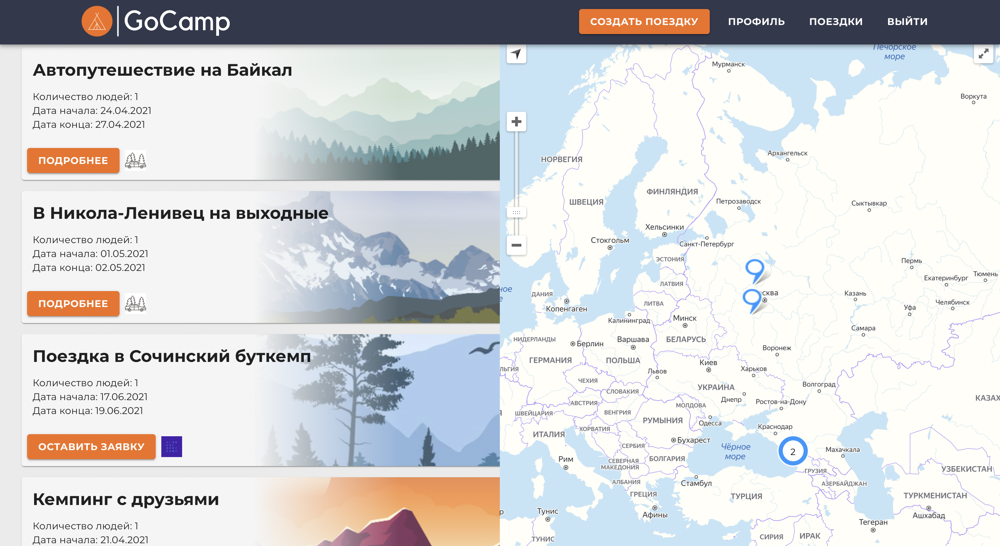

# GoCamp

## Введение
Приложение по поиску и созданию путешествий за город.


**Рисунок 1. Главная страница**


**Рисунок 2. Динамическая карта с отображением всех активных поездок**
## Функциональность
В данном приложении вы можете создавать собственные путешествия, приглашать либо отклонять участников, обсуждать детали в интегрированном чате, составлять совместно интерактивный чек-лиск, прокладывать маршрут, а также расчитывать стоимость бензина на каждого участника до точки назначения.
Также, на начальной стадии создания, система "достижений" отображающая интересы и опыт в путешествиях каждого пользователя.

**Рисунок 2. Страница создания поездки**
## В планах
1. Мобильная версия приложения на react-native
2. Система рекомендаций с готовыми решениями для путешествий.
## Запуск
В папкe /client запустить команду
```bash
npm start
```
